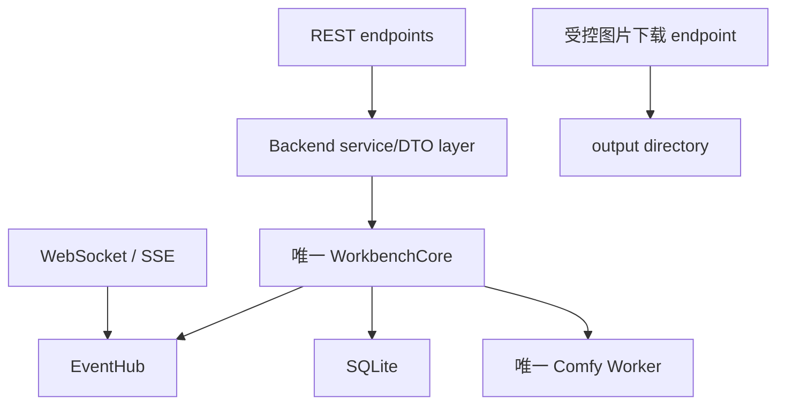

# FastAPI 后端接入 diffusion-workbench-core

本文面向接手 FastAPI 的开发者，描述如何把现有 Core 包装为单机 HTTP 服务。先阅读
[Core 技术参考](core-technical-reference.md)，本文不重复内部推理实现。

## 1. 设计结论

FastAPI 只能作为 Core 的调用端，不应重新实现以下能力：

- GPU 串行队列；
- SQLite 任务状态机；
- 随机 seed 解析；
- 模型加载、缓存、切换和释放；
- ComfyUI Worker 子进程；
- 输出路径和每日编号。

推荐结构：



必须满足的部署条件：

- 一个 OS 进程；
- 一个 `WorkbenchCore`；
- 一个 Core event sink；
- 一个 GPU Worker；
- Uvicorn `--workers 1`；
- 所有生成任务只调用 `core.submit()`。

## 2. 建议目录

下一阶段可以增加独立调用端包，不要把 FastAPI 代码放进 Core：

```text
diffusion_workbench_api/
  __init__.py
  app.py             # FastAPI factory / lifespan
  dependencies.py    # get_core/get_hub
  schemas.py         # Pydantic request/response DTO
  resources.py       # 安全资源选择
  jobs.py            # REST router
  events.py          # EventHub + WS/SSE router
  files.py           # output 文件访问
tests/
  test_api_*.py
```

`pyproject.toml` 需要新增 FastAPI 和 ASGI server 依赖；不要把 FastAPI 变成
`diffusion_workbench_core` 的导入依赖。

## 3. 应用 lifespan

不要在模块 import 时创建 Core。使用 FastAPI lifespan，确保启动失败可见、退出一定释放
GPU Worker 和数据库锁。

```python
from __future__ import annotations

import asyncio
from contextlib import asynccontextmanager
from pathlib import Path

from fastapi import FastAPI

from diffusion_workbench_core import WorkbenchCore


@asynccontextmanager
async def lifespan(app: FastAPI):
    loop = asyncio.get_running_loop()
    core = await asyncio.to_thread(
        WorkbenchCore.from_config,
        Path("configs/workbench.yaml"),
    )
    hub = EventHub(loop)
    core.set_event_sink(hub.emit_from_core_thread)
    app.state.core = core
    app.state.event_hub = hub
    try:
        yield
    finally:
        hub.close()
        await asyncio.to_thread(core.shutdown)


app = FastAPI(lifespan=lifespan)
```

`shutdown()` 可能等待当前 Worker 退出，必须放进 `asyncio.to_thread()`，否则会阻塞
ASGI event loop。Core 关闭后不能恢复使用。

## 4. Core 事件到 asyncio 的桥接

Core callback 在 Controller 后台线程执行，不能直接 `await websocket.send_json()`，也不能
在该线程操作 `asyncio.Queue`。只安装一个非阻塞桥接器，然后在 event loop 内扇出。

```python
from __future__ import annotations

import asyncio
from collections.abc import Iterator


class EventHub:
    def __init__(self, loop: asyncio.AbstractEventLoop):
        self._loop = loop
        self._subscribers: set[asyncio.Queue[dict]] = set()
        self._closed = False

    def emit_from_core_thread(self, event: dict) -> None:
        if not self._closed:
            self._loop.call_soon_threadsafe(self._publish, event.copy())

    def _publish(self, event: dict) -> None:
        for queue in tuple(self._subscribers):
            if queue.full():
                try:
                    queue.get_nowait()
                except asyncio.QueueEmpty:
                    pass
            queue.put_nowait(event)

    def subscribe(self, max_events: int = 128) -> asyncio.Queue[dict]:
        queue: asyncio.Queue[dict] = asyncio.Queue(maxsize=max_events)
        self._subscribers.add(queue)
        return queue

    def unsubscribe(self, queue: asyncio.Queue[dict]) -> None:
        self._subscribers.discard(queue)

    def close(self) -> None:
        self._closed = True
        self._subscribers.clear()
```

队列必须有上限。慢客户端不应反向阻塞 Controller；丢失的实时事件通过重新读取 SQLite
任务状态恢复。若前端需要完全可靠的事件历史，应新增持久化 event/outbox，而不是让
Core callback 等待网络发送。

不要对每个 WebSocket 调用 `core.set_event_sink()`。该方法只有一个 slot，后设置的连接
会让之前连接停止收到事件。

## 5. 依赖注入

```python
from fastapi import Request


def get_core(request: Request) -> WorkbenchCore:
    return request.app.state.core


def get_event_hub(request: Request) -> EventHub:
    return request.app.state.event_hub
```

Core 不是 request-scoped 对象，不允许在 dependency 中重复构造。

## 6. 建议 REST API

第一版建议保持接口小而稳定：

| Method | Path | 用途 |
|---|---|---|
| `GET` | `/api/v1/health` | 进程存活；Worker stopped 也可健康 |
| `GET` | `/api/v1/status` | 队列、running job、Worker、GPU |
| `GET` | `/api/v1/resources/{mode}/{kind}` | 模型或 VAE 列表 |
| `PUT` | `/api/v1/resources/{mode}/{kind}/{index}/alias` | 设置 alias |
| `POST` | `/api/v1/jobs` | 提交一张或一批任务 |
| `GET` | `/api/v1/jobs/{job_id}` | 读取持久化状态 |
| `GET` | `/api/v1/jobs` | 历史分页，需先补 Core list API |
| `POST` | `/api/v1/control/stop` | 全局停止并清空队列 |
| `GET` | `/api/v1/images/{job_id}` | 受控读取已完成图片 |
| `WS` | `/api/v1/events` | 实时公共事件流 |

不要把 `POST /control/stop` 设计成 `DELETE /jobs/{id}`。当前 Core 没有按 job id 取消的
能力，伪装成单任务取消会误导客户端并取消其他用户的全部任务。

## 7. DTO 与资源选择

客户端只提交 mode、资源引用和生成参数。text encoder、clip type、sampler、scheduler、
CFG 由服务器固定，不接受客户端路径或覆盖值。

```python
from typing import Literal

from pydantic import BaseModel, Field


class CreateJobsRequest(BaseModel):
    mode: Literal["zit", "krea2"] = "zit"
    model_index: int = Field(ge=1)
    vae_index: int = Field(ge=1)
    prompt: str = Field(min_length=1, max_length=16_000)
    width: int = 576
    height: int = 576
    steps: int = Field(default=8, ge=8, le=20)
    seed: int = Field(default=-1, ge=-1)
    count: int = Field(default=1, ge=1, le=32)
```

`count <= 32` 只是建议的 HTTP admission limit，不是 Core 限制。根据磁盘和服务策略调整。

资源 index 会在目录内容变化后重新排序，不是永久 ID。第一版可以要求客户端先获取资源
列表再提交；稳定版应改为 alias 或由 Core 生成 resource id。即使使用 index，也必须
从 Core 返回列表中解析：

```python
from diffusion_workbench_core import GenerationSettings, Mode, ResourceKind


def _resource_at(core, mode: Mode, kind: ResourceKind, index: int):
    for item in core.list_resources(mode, kind):
        if item.index == index:
            return item
    raise LookupError(f"resource index {index} not found")


def submit_jobs(core, payload: CreateJobsRequest):
    mode = Mode(payload.mode)
    model = _resource_at(core, mode, ResourceKind.DIFFUSION, payload.model_index)
    vae = _resource_at(core, mode, ResourceKind.VAE, payload.vae_index)
    fixed = core.config.resources[mode]
    settings = GenerationSettings(
        mode=mode,
        model=model,
        vae=vae,
        text_encoder=fixed.text_encoder,
        clip_type=fixed.clip_type,
        prompt=payload.prompt,
        width=payload.width,
        height=payload.height,
        steps=payload.steps,
        seed=payload.seed,
    )
    return core.submit(settings, payload.count)
```

HTTP handler 使用线程执行：

```python
from fastapi import APIRouter, Depends, HTTPException, status

router = APIRouter(prefix="/api/v1")


@router.post("/jobs", status_code=status.HTTP_202_ACCEPTED)
async def create_jobs(payload: CreateJobsRequest, core=Depends(get_core)):
    try:
        jobs = await asyncio.to_thread(submit_jobs, core, payload)
    except LookupError as exc:
        raise HTTPException(status_code=404, detail=str(exc)) from exc
    except ValueError as exc:
        raise HTTPException(status_code=422, detail=str(exc)) from exc
    return {"jobs": [job_to_response(job) for job in jobs]}
```

不要直接对 dataclass 使用 `asdict()` 后返回：其中包含 `Path`、`Enum` 和 `datetime`。
写显式 serializer/response model，控制是否泄露本机路径和完整 prompt。

## 8. 提交响应和 seed

`POST /jobs` 只表示已持久化并入队，应该返回 HTTP 202。随机 seed 的任务此时仍是 `-1`：

```json
{
  "jobs": [
    {
      "id": "job-uuid",
      "batch_id": null,
      "status": "queued",
      "mode": "krea2",
      "seed": -1,
      "width": 576,
      "height": 576,
      "steps": 8,
      "output_name": "krea2-00009.png"
    }
  ]
}
```

实际随机 seed 在 `job_started` 中公布并写回 SQLite。批量固定 seed 会让所有任务使用同
一个 seed；批量 `seed=-1` 会为每个任务分别生成随机 seed。

## 9. 任务读取接口的当前缺口

当前 `WorkbenchCore` 没有正式的 `get_job/list_jobs` 方法。FastAPI MVP 有两个选择：

### 临时桥接

```python
job = await asyncio.to_thread(core.store.get_job, job_id)
```

这是当前代码可运行的最短路径，但 `store` 是内部组件。只能集中封装在 backend service
中，router 和前端不得直接依赖它。

### 推荐修复

先在 Core 增加：

```python
def get_job(self, job_id: str) -> JobRecord: ...
def list_jobs(self, *, status=None, mode=None, limit=50, cursor=None): ...
```

分页使用稳定 cursor，例如 `(submitted_at, id)`，不要使用 offset 作为长期方案。数据库
访问仍由 `JobStore` 实现，FastAPI 不应自行拼 SQLite SQL。

如果下一阶段只实现生成与实时状态，可以暂时不做历史列表，但必须保留 `GET /jobs/{id}`，
否则客户端断线后无法恢复任务结果。

## 10. WebSocket 事件流

```python
from fastapi import WebSocket, WebSocketDisconnect


@app.websocket("/api/v1/events")
async def events(websocket: WebSocket):
    await websocket.accept()
    hub: EventHub = websocket.app.state.event_hub
    queue = hub.subscribe()
    try:
        while True:
            event = await queue.get()
            await websocket.send_json(public_event(event))
    except WebSocketDisconnect:
        pass
    finally:
        hub.unsubscribe(queue)
```

FastAPI lifespan 中若需要采样预览，调用一次 `core.set_preview_enabled(True)`。Core 默认
关闭预览，避免不消费预览的调用端承担编码开销。

建议 `public_event()`：

- 保留 type、job_id、status、stage、step、total、seed、queue counts；
- 保留 `step_progress` 的速度和 ETA 字段；
- 把 `output_path` 转换为 `/api/v1/images/{job_id}`，不暴露绝对路径；
- 对 error 记录完整服务端日志，只向非管理员客户端发送安全摘要；
- 可增加后端自己的单调 `event_id`，便于前端丢弃乱序事件。

Core 原始事件包括：

```text
queue_progress
job_started
stage_progress
step_progress
preview_image (仅启用预览后)
job_error
job_finished
```

`preview_image.data` 是 base64 JPEG。后端可直接发 JSON；更高效的实现是解码后发送带
job/step 关联信息的 WebSocket 二进制帧。预览是瞬时状态，不应持久化或进入事件重放。

stage 顺序：

```text
starting_worker -> loading_model -> prompt -> latent -> sampling
-> vae -> saving -> saved
```

WebSocket 不是事实数据库。连接后先订阅，再获取任务/队列快照；重连后重新请求
`GET /jobs/{id}` 和 `GET /status`。不要假设每个 queued cancellation 都有一条可重放事件。

## 11. 状态和健康检查

`GET /status` 可以包装 `core.runtime_status()`：

```json
{
  "queue": 1,
  "running": "job-uuid",
  "worker": "ready",
  "pid": 1028,
  "loaded_model": "internal-value-or-redacted",
  "gpu": "10.42/15.92 GiB"
}
```

公开接口应隐藏 `pid`、模型绝对路径等不需要的信息。

健康语义：

- Core 构造成功、Controller 线程存在、数据库可用：服务 ready；
- Worker `stopped`：首个任务前或 stop 后的正常惰性状态；
- GPU `查询中/不可用`：不一定代表服务失败；
- 真正的 ComfyUI/模型兼容性只能由一次任务验证，当前没有无成本 warmup endpoint。

`runtime_status()` 的 GPU probe 已在后台执行，handler 仍建议通过 `to_thread()` 调用以保持
调用方式一致。

## 12. 图片访问

客户端不能传服务器文件路径。`GET /images/{job_id}` 应执行：

1. 从 Core/JobStore 获取 job；
2. 确认 `status == completed`；
3. 解析 output path；
4. 确认 path 位于配置的 `output_dir` 内；
5. 确认文件存在且为普通文件；
6. 使用 `FileResponse(..., media_type="image/png")`。

```python
output_root = core.config.output_dir.resolve()
path = job.output_path.resolve()
if not path.is_relative_to(output_root):
    raise HTTPException(status_code=500, detail="invalid stored output path")
```

不要增加任意 `/files?path=...` 接口。最终输出由 Worker 原子创建，读取 completed job 时不
会看到半张 PNG。

## 13. stop 与服务退出

`POST /control/stop` 是管理员级全局操作，应明确返回：

```json
{
  "accepted": true,
  "scope": "running-and-entire-queue"
}
```

它会终止当前 Worker，因此下一张任务需要重新启动 Worker和加载模型。接口应有鉴权和
重复点击保护，但 Core 的 `stop()` 本身可重复调用。

应用退出由 lifespan 调用 `shutdown()`，不要同时让多个 shutdown hook 并行执行。Core
内部和 CLI 都有幂等保护，但后端仍应只有一个生命周期所有者。

## 14. HTTP 错误映射

| Core/后端错误 | HTTP 建议 |
|---|---:|
| Pydantic/`GenerationSettings` 参数错误 | 422 |
| 资源 index/alias/job 不存在 | 404 |
| 第二个 Core 抢占同一数据库锁 | 启动失败，不应启动 HTTP listener |
| Core 已关闭 | 503 |
| 队列 admission limit | 429 |
| output 尚未完成 | 409 或 404，固定一种 |
| output 记录存在但文件丢失 | 410 或 500 |
| Worker 运行时失败 | POST 已返回 202；通过 job 状态/event 报告 |

不要因为后台 job 失败而尝试修改已经完成的 POST 202 响应。

## 15. 单进程部署

开发/单机运行：

```powershell
uv run uvicorn diffusion_workbench_api.app:app `
  --host 127.0.0.1 `
  --port 8000 `
  --workers 1
```

禁止：

```text
uvicorn ... --workers 2
gunicorn -w 4 ...
在 TUI 运行时再启动一个 FastAPI Core
模块 import 时创建 Core，然后由进程管理器 fork
```

生产部署若需要多个 HTTP worker，必须先把 GPU Core 提取为独立单例服务，通过 IPC/RPC
调用；不能让每个 Web worker 各持一个 Core。当前单机目标无需做这层拆分。

`--reload` 只用于开发。重载会关闭并重建 Core，运行中任务将被恢复为 cancelled，模型
缓存也会丢失。

## 16. 安全边界

Core 默认信任本地调用端，FastAPI 暴露网络后必须补：

- 鉴权，尤其是 submit、alias、stop；
- prompt 和请求体大小限制；
- count、排队数量和提交速率限制；
- 服务端内容安全策略；
- CORS allowlist；
- 图片路径校验；
- 不向客户端泄露绝对路径、traceback、PID 和本机配置；
- 不接受任意 model/VAE/text encoder/output 路径；
- 日志中按产品要求处理 prompt 等敏感内容。

Core 不含内容审核，不能因为本地 TUI 可用就直接暴露到公网。

## 17. 可观测性

建议记录结构化日志：

- request id、job id、batch id；
- submitted/started/completed 与 queue wait duration；
- mode、资源 alias/文件名、size、steps、seed；
- Worker PID 变化和模型切换；
- stage 与 step，不记录每次 GPU probe 为 info；
- load/generation duration；
- CUDA peak allocated/reserved（当前 Worker result 已提供，但尚未提升到公共事件/DB）；
- job error 的完整 traceback 仅服务端保存。

不要从 event sink 执行同步日志网络上传。先入本地非阻塞队列，再由独立任务批量输出。

## 18. 测试策略

FastAPI 第一版至少需要：

### 无 GPU 单元/集成测试

- lifespan 只创建一个 Core，并在退出时 shutdown；
- POST 请求到 `GenerationSettings` 的映射；
- 任意路径不能绕过资源目录；
- `seed=-1` 的 queued 响应与 `job_started` 实际 seed；
- count 批量响应和 batch id；
- Core event thread 到 asyncio EventHub；
- 慢/断开的 WebSocket 不阻塞 event sink；
- WebSocket 多订阅者都收到事件；
- 重连后可通过 GET job 恢复；
- stop 明确清空整个队列；
- 图片 endpoint 阻止路径穿越；
- Uvicorn 配置固定单 worker。

测试使用 fake Core 或现有 fake runtime，不能在普通 test suite 中加载真实模型。

### 本机 GPU smoke test

1. 启动 FastAPI；
2. 列出 ZIT/Krea2 资源；
3. 各提交一张 576x576；
4. 验证事件从 starting_worker 到 saved、step 从 1 到 n；
5. 验证 GET job 最终 completed 和 PNG 可下载；
6. 同模型第二张确认 Worker PID 不变；
7. 切模型确认重新加载；
8. 运行任务时 stop，确认当前/队列 cancelled、Worker stopped；
9. 再提交一张确认 Worker 可重启；
10. 退出 API，确认 Comfy Python 子进程和 GPU 资源释放。

## 19. 推荐实施顺序

1. 新建 `diffusion_workbench_api` 包与 FastAPI lifespan；
2. 实现显式 Pydantic DTO 和资源解析；
3. 实现 POST jobs、GET status/resources；
4. 把 `get_job/list_jobs` 提升为 Core 公共方法；
5. 实现 GET job/history/image；
6. 实现单 sink EventHub 和 WebSocket；
7. 实现全局 stop；
8. 补安全、限流和结构化日志；
9. 跑 fake Core 测试；
10. 跑单进程本机 GPU smoke test。

## 20. 完成标准

FastAPI 第一版完成时应满足：

- HTTP handler 不直接导入 ComfyUI；
- Core 在 lifespan 中唯一创建和关闭；
- 服务进程始终单 worker；
- 所有任务经 `core.submit()` 串行执行；
- 任意客户端不能注入本地路径；
- seed、状态、错误和图片可在断线后从持久化数据恢复；
- WebSocket 断开不影响生成；
- stop 的全局语义在 API 与 UI 中明确；
- API 退出后无 Comfy Python 子进程；
- ZIT/Krea2 的真实 smoke test 均通过。
