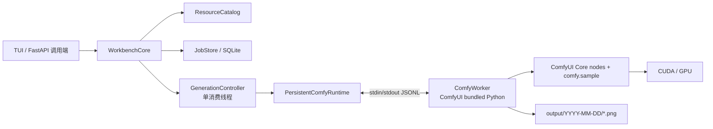
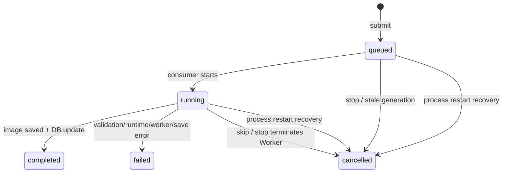
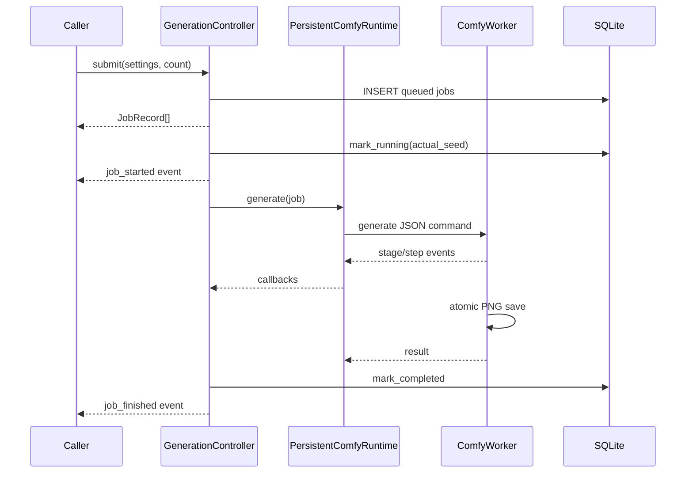

# diffusion-workbench-core 技术参考

本文描述当前 `diffusion_workbench_core` 的真实实现和调用契约。它是 TUI 与后续
FastAPI 服务共同复用的核心层，不包含 HTTP、WebSocket 或界面状态。

相关文档：

- [FastAPI 后端接入指南](backend-integration.md)
- [CLI/TUI 使用说明](workbench-cli.md)
- [生成预览、速度与 PNG 元数据](generation-preview-speed-and-metadata.md)
- [Core 日志与任务审计记录](core-logging-and-job-audit.md)
- [Krea2 非 ComfyUI 后端研究](krea2-alternative-backends.md)

## 1. 当前能力与边界

核心目前支持：

- ZIT 与 Krea2 两种模式；
- 每种模式独立的 diffusion、VAE 目录和固定 text encoder；
- Euler sampler + simple scheduler，CFG 固定为 1；
- 576x576 默认尺寸，宽高必须是 16 的倍数；
- 8 到 20 步；
- 固定 seed 或 `-1` 随机 seed；
- 单 GPU 串行队列和批量任务；
- 模型跨任务复用、切模重载、跳过/停止/退出释放；
- SQLite 任务记录、资源别名和原子 PNG 输出；
- 队列、执行阶段、采样速度/ETA、可选 latent 预览、错误和完成事件；
- 带版本化生成参数 iTXt 元数据的 PNG 输出。
- 独立的 UTF-8 轮转运行日志和 Worker stdout/stderr 持久化。

核心不负责：

- HTTP 鉴权、限流、CORS、内容安全或用户隔离；
- 任意 ComfyUI workflow；
- 并行 GPU 推理或多个 GPU Worker；
- 按任意 job id 取消；当前只支持跳过正在运行的任务或全局停止；
- 稳定的分页历史查询 API；当前只有 `JobStore.get_job()`；
- 持久化事件流；事件只在进程内实时投递，SQLite 才是最终事实来源。

## 2. 进程与模块架构



主进程运行项目的 uv 环境，负责 API/TUI、SQLite、队列和进程管理。GPU Worker
使用配置中的 ComfyUI bundled Python，以子进程形式导入 ComfyUI Core。两套 Python
环境通过换行分隔的 JSON 通信，不共享 Python 对象。

这不是向 ComfyUI HTTP 服务提交 workflow，也不会启动 ComfyUI Web UI。Worker
直接调用 `UNETLoader`、`CLIPLoader`、`VAELoader`、`CLIPTextEncode`、`VAEDecode`
以及 `comfy.sample.sample()`。

### 2.1 包内职责

| 模块 | 职责 |
|---|---|
| `core.py` | 公共门面、配置边界校验、实例锁与组件装配 |
| `domain.py` | `Mode`、`ResourceItem`、`GenerationSettings`、`JobRecord` |
| `config.py` | YAML 解析与路径解析 |
| `catalog.py` | 模型/VAE 扫描和别名合并 |
| `storage.py` | SQLite schema、任务状态、输出编号和别名 |
| `controller.py` | 串行队列、随机 seed、状态转换和公共事件 |
| `persistent_runtime.py` | Worker 子进程、IPC、超时、取消和 GPU 状态 |
| `comfy_worker.py` | ComfyUI 加载、推理、模型复用和 PNG 写入 |
| `runtime.py` | 推理运行时 Protocol 与取消异常 |
| `instance_lock.py` | 单数据库单 Core 实例锁 |

## 3. 公共入口

包根当前导出：

```python
from diffusion_workbench_core import (
    GenerationSettings,
    Mode,
    ResourceKind,
    WorkbenchCore,
)
```

### 3.1 创建与关闭

```python
from diffusion_workbench_core import WorkbenchCore

core = WorkbenchCore.from_config("configs/workbench.yaml")
try:
    ...
finally:
    core.shutdown()
```

也可以先调用 `load_config()`，再使用 `WorkbenchCore(config)`。初始化顺序为：

1. 获取 `<database>.lock` 非阻塞文件锁；
2. 创建/打开 SQLite schema；
3. 将上次异常退出遗留的 `queued`、`running` 任务标记为 `cancelled`；
4. 创建资源目录；
5. 创建惰性 Worker runtime；
6. 启动队列消费线程。

初始化不会启动 Comfy Worker，也不会加载模型。第一次真正执行任务时才启动 Worker。

`shutdown()` 会停止队列、关闭 Worker、等待控制线程退出并释放实例锁。关闭后的 Core
不能复用；需要重新创建实例。调用端必须在 lifespan/finally 中执行它。

### 3.2 当前公共方法

| 方法 | 返回/效果 | 注意事项 |
|---|---|---|
| `list_resources(mode, kind)` | `list[ResourceItem]` | 读取文件系统和 SQLite 别名 |
| `set_alias(mode, kind, path, alias)` | 无 | 同 mode/kind 内 alias 唯一 |
| `submit(settings, count)` | `list[JobRecord]` | 只入队，不等待图片完成 |
| `runtime_status()` | `dict` | GPU 数据最多约 2 秒陈旧 |
| `set_event_sink(callback)` | 无 | 只有一个 sink，后设置会覆盖前一个 |
| `set_preview_enabled(enabled)` | 无 | 默认关闭；FastAPI 启用后发送 base64 JPEG 预览事件 |
| `skip_current()` | `str | None` | 接受时返回 job id；无可跳过任务时返回 `None`；失败时抛 `RuntimeError` |
| `stop()` | 无 | 取消当前任务并清空全部等待任务 |
| `shutdown()` | 无 | 永久关闭该实例并释放资源 |

`core.store`、`core.catalog`、`core.controller` 和 `core.runtime` 当前可访问，但属于内部
组件。后端第一版若必须读取单个任务，只能临时使用 `core.store.get_job(job_id)`；长期
应把 `get_job()`、`list_jobs()` 提升为 `WorkbenchCore` 的正式公共方法。
`core.log_path` 是本实例 Core 诊断日志的绝对路径。

## 4. 配置契约

```yaml
comfyui:
  root: C:\path\to\ComfyUI
  python: C:\path\to\ComfyUI-python\python.exe

resources:
  zit:
    diffusion:
      - D:\models\diffusion_models\zit
    vae:
      - D:\models\vae\zit
    text_encoder: D:\models\text_encoders\qwen_3_4b.safetensors
    clip_type: stable_diffusion
  krea2:
    diffusion:
      - D:\models\diffusion_models\krea2
    vae:
      - D:\models\vae\krea2
    text_encoder: D:\models\text_encoders\qwen3vl_4b_fp8_scaled.safetensors
    clip_type: krea2

output_dir: output
database: .cache\diffusion_workbench.sqlite3
worker_timeout_seconds: 300
```

`diffusion` 和 `vae` 接受多个目录。相对路径通常相对于 YAML 所在目录；当 YAML 的
父目录名恰好是 `configs` 时，基准目录会上移到项目根目录。服务部署建议对 ComfyUI、
模型、output 和 database 使用明确的绝对路径，避免工作目录变化改变数据位置。

`worker_timeout_seconds` 同时限定单任务等待时间；Worker 启动等待时间为该值与 60 秒
中的较小值。

## 5. 领域对象与校验

### 5.1 `Mode` 与 `ResourceKind`

```python
Mode.ZIT     # "zit"
Mode.KREA2   # "krea2"

ResourceKind.DIFFUSION  # "diffusion"
ResourceKind.VAE        # "vae"
```

### 5.2 `ResourceItem`

```python
ResourceItem(index=1, path=Path("..."), alias="portrait")
```

`display_name` 为 `alias (filename)` 或纯文件名。index 按文件名大小写不敏感排序后从
1 开始，只适合当前资源列表的一次交互；添加或删除文件后 index 可能变化。HTTP API
不应把 index 当作永久资源 ID。

### 5.3 `GenerationSettings`

```python
settings = GenerationSettings(
    mode=Mode.KREA2,
    model=model_item,
    vae=vae_item,
    text_encoder=core.config.resources[Mode.KREA2].text_encoder,
    clip_type=core.config.resources[Mode.KREA2].clip_type,
    prompt="an adult studio portrait",
    width=576,
    height=576,
    steps=8,
    seed=-1,
)
```

校验规则：

- prompt 去除空白后不能为空；
- 宽高为正数且是 16 的倍数；
- steps 在 8 到 20 之间；
- seed 为 `-1` 或非负整数；
- sampler 必须为 `euler`；
- scheduler 必须为 `simple`；
- CFG 必须为 `1.0`。

`WorkbenchCore.submit()` 还会校验：

- text encoder 和 clip type 必须等于该 mode 的固定配置；
- model 必须来自该 mode 配置的 diffusion 目录；
- VAE 必须来自该 mode 配置的 VAE 目录。

调用端不得接受客户端传来的任意绝对路径后自行构造 `ResourceItem`。必须从
`list_resources()` 返回值中选择，避免越权读取服务器文件。

### 5.4 seed 语义

- 固定非负 seed：任务直接使用该值；批量提交会让每张图使用同一个 seed。
- `-1`：任务入库时保存 `-1`，真正开始前用 `secrets.randbelow(2**63)` 生成随机值，
  随后更新 SQLite，并通过 `job_started` 事件发出实际 seed。

因此 `submit()` 返回的随机任务仍可能显示 `seed=-1`；最终 seed 应从 SQLite 或
`job_started` 获取。

## 6. 资源目录与别名

资源扫描规则：

- 只扫描配置目录的第一层，不递归；
- 识别 `*.safetensors` 和 `*.sft`；
- 以解析后的绝对路径去重；
- 按文件名大小写不敏感排序；
- alias 按绝对路径保存在 SQLite；
- alias 在同一个 `(mode, kind)` 内唯一，不同 mode/kind 可以复用同名 alias。

当前没有资源扫描缓存。每次 `list_resources()` 都会读取目录；模型格式检测缓存属于旧
demo/研究工具，不属于当前 Core 的提交路径。

## 7. 队列和任务状态机

每个 Core 只有一个 `GenerationController` 线程和一个串行队列。无论多少调用线程同时
提交，GPU 任务都依次执行。



批量 `count > 1` 的任务共享一个 UUID `batch_id`，但每张图有独立 job id、seed、状态和
输出路径。任务设置在提交时完整快照，提交后修改调用端配置不会影响已排队任务。

`stop()` 的语义是全局停止：

1. 增加队列 generation，防止已取出但未启动的旧任务继续运行；
2. 清空等待队列并将这些任务标记为 `cancelled`；
3. 若存在运行中任务，终止整个 Comfy Worker 进程；
4. 下一次任务会创建一个干净的新 Worker。

`skip_current()` 只处理当前运行任务：

1. 不增加队列 generation，也不移除任何等待任务；
2. 标记当前 job 为取消目标并终止其 Worker；
3. 当前 job 写为 `cancelled` 后，消费线程继续取下一项并创建干净的新 Worker；
4. 没有等待任务时，Worker 保持停止，Controller 进入空闲状态；
5. 空闲、准备阶段或已经认领完成结果时返回 `None`，不修改队列和 SQLite；
6. Worker 取消失败时撤销 skip 标记并抛出 `RuntimeError`，不会伪报跳过成功。

取消动作在 Controller 状态锁内发起，避免当前任务自然结束的同时误终止刚启动的下一项。
当前仍不支持 `cancel(job_id)`，也不能用 skip 取消等待队列中的指定任务。FastAPI 不应把
`stop()` 包装成单任务 DELETE。

## 8. Worker 生命周期和模型复用



Worker 是长生命周期子进程：

- 第一次任务惰性启动；
- 同路径 diffusion/text encoder/VAE 复用已加载 Python 对象；
- 同 mode 切换 diffusion 时释放 GPU 已加载模型，再载入新 checkpoint；
- 跨 mode 时调用完整 `release()`；
- 成功任务结束后保留资源，以加速下一张；
- 失败时 Worker 执行 `release()`，保留进程但清空模型；
- `skip_current()` / `stop()` 直接终止进程；
- `shutdown()` 请求优雅释放，10 秒内未退出则终止。

ComfyUI 的动态显存管理可能在 VAE 阶段把部分 diffusion 权重移到 CPU/pinned RAM。
所以“模型保持加载”不等于所有权重始终驻留独占显存；它表示 checkpoint 对象和可复用
缓存仍存在，下次任务无需从头构建整个 pipeline。

## 9. 推理路径

Worker 完整生成路径运行在 `torch.inference_mode()` 中，与 ComfyUI 正式执行器一致。
阶段顺序为：

| stage | 含义 |
|---|---|
| `starting_worker` | Runtime 正在确认或启动子进程 |
| `loading_model` | diffusion、text encoder、VAE 对象检查/加载 |
| `prompt` | CLIP/Qwen text encoder 编码 prompt |
| `latent` | 创建 `[1, 16, H/8, W/8]` latent |
| `sampling` | Euler + simple 采样 |
| `vae` | VAE 解码 |
| `saving` | 转换并写入 PNG |
| `saved` | PNG 已原子落盘 |

negative conditioning 由 positive conditioning 经过 `ConditioningZeroOut` 得到。噪声由
`comfy.sample.prepare_noise(latent, seed)` 生成，采样直接调用
`comfy.sample.sample()`，CFG `1.0`、denoise `1.0`。

输出先写入目标目录内的隐藏临时文件，再通过 hard link 创建最终路径，最后删除临时
文件。目标已存在时不会覆盖；JobStore 的数据库编号与目录扫描共同避免重用已有编号。
PNG 的 `diffusion_workbench` iTXt 块保存 schema version、实际生成参数、资源路径/文件名/
SHA-256、运行时版本和性能数据。资源哈希按绝对路径、大小和修改时间在 Worker 内缓存；
首次使用资源会完整读取文件计算哈希，后续任务复用缓存。
`read_generation_metadata(path)` 可以在没有 SQLite 的情况下读取。

## 10. IPC 协议

Runtime 通过 stdin 向 Worker 发送一行一个 JSON command。Worker stdout 中只有以
`DWB_EVENT=` 开头的行会被解析为事件，其余输出保留最近 100 行用于异常诊断。stderr
合并到 stdout。

内部 Worker 事件包括 `ready`、`startup_error`、`stage_progress`、`step_progress`、
`preview_image`、`result`、`error` 和 `stopped`。Runtime 将与当前 job 匹配的事件
转换为 Controller 行为。Worker error 包含完整 traceback，最终写入任务 `error` 字段。

单任务超过 `worker_timeout_seconds` 时，Runtime 终止 Worker，并将任务标记为失败。

## 11. 公共事件契约

`set_event_sink(callback)` 设置唯一公共事件接收器。callback 在 Controller 后台线程中
同步调用，必须快速、非阻塞、线程安全；任何 callback 异常都会被 Core 吞掉，不能影响
生成线程。Web 后端必须只安装一个桥接 callback，再由自己的 EventHub 扇出。

### `queue_progress`

```json
{
  "type": "queue_progress",
  "queued": 2,
  "running": "job-uuid-or-null",
  "steps": 8,
  "sequence": 17
}
```

`sequence` 只对 queue snapshot 单调递增，用于丢弃多线程投递造成的旧快照。

### `job_started`

```json
{
  "type": "job_started",
  "job_id": "job-uuid",
  "seed": 6339795016295235492,
  "steps": 8
}
```

### `stage_progress`

```json
{
  "type": "stage_progress",
  "job_id": "job-uuid",
  "stage": "vae",
  "total": 8
}
```

### `step_progress`

```json
{
  "type": "step_progress",
  "job_id": "job-uuid",
  "step": 3,
  "total": 8,
  "elapsed_seconds": 6.0,
  "step_seconds": 2.1,
  "seconds_per_step": 2.0,
  "steps_per_second": 0.5,
  "eta_seconds": 10.0
}
```

step 从 1 开始。进入 sampling 但尚无 step callback 时，调用端可显示 `0/n`；进入采样
前显示 `未开始/n`。速度和 ETA 在 Worker 内按墙钟时间计算，包含已发生的预览编码开销。

### `preview_image`

调用 `set_preview_enabled(True)` 后，每个采样步骤紧随 `step_progress` 发出近似 latent
预览；默认关闭，因此 TUI 不承担预览生成和传输开销。

```json
{
  "type": "preview_image",
  "job_id": "job-uuid",
  "step": 3,
  "total": 8,
  "mime_type": "image/jpeg",
  "encoding": "base64",
  "width": 72,
  "height": 72,
  "data": "/9j/4AAQ..."
}
```

这是 Latent2RGB 近似图，不运行完整 VAE。FastAPI 可以解码 `data` 后转成 WebSocket
二进制帧；不要把 base64 内容写入常规 info 日志。

### `job_error`

```json
{
  "type": "job_error",
  "job_id": "job-uuid-or-null",
  "error": "RuntimeError: ...\ntraceback..."
}
```

### `job_finished`

```json
{
  "type": "job_finished",
  "job_id": "job-uuid",
  "status": "completed",
  "output_path": "D:\\output\\2026-07-27\\krea2-00008.png",
  "steps": 8
}
```

事件不持久化、不重放，也没有覆盖所有 queued cancellation 的逐任务通知。客户端断线或
服务重启后必须查询 SQLite 状态，不能仅凭 WebSocket 事件重建事实。

## 12. Runtime 状态

`runtime_status()` 当前返回：

```python
{
    "queue": 2,
    "running": "job-uuid-or-None",
    "worker": "ready" or "stopped",
    "pid": 1234 or None,
    "loaded_model": "absolute-path-or-None",
    "gpu": "10.42/15.92 GiB" or "查询中" or "不可用",
}
```

`worker="stopped"` 在尚未执行首个任务时是正常状态，不等于服务不健康。GPU 查询使用
后台 `nvidia-smi`，最多每 2 秒触发一次，不阻塞调用者，也不表示当前 job 的独占显存。

## 13. SQLite 与输出

数据库启用 WAL。核心表：

### `aliases`

| 字段 | 含义 |
|---|---|
| `mode` | `zit` / `krea2` |
| `kind` | `diffusion` / `vae` |
| `path` | 解析后的绝对路径 |
| `alias` | mode/kind 内唯一名称 |

### `jobs`

持久化字段包括：id、batch_id、status、提交/开始/完成时间、用时、output path/date/index、
mode、prompt、model、VAE、text encoder、sampler、scheduler、width、height、steps、seed、
CFG 和 error。

状态转换和最终 seed 都会写回数据库。启动恢复会把遗留 `queued`/`running` 统一标记为
`cancelled`，错误信息为“Workbench 上次退出时任务未完成”。

`jobs.output_path` 是生成时的历史路径快照，不是任务记录有效性的条件。图片移动或删除后，
任务仍保留且可由任务读取接口完整读取；图片下载端点可单独返回 `410 Gone`。
Core 不会因文件缺失修改 completed 状态。详细契约和日志格式见
[Core 日志与任务审计记录](core-logging-and-job-audit.md)。

输出命名：

```text
output/YYYY-MM-DD/<mode>-NNNNN.png
```

编号按日期和 mode 独立增长。即使数据库被删除，JobStore 也会扫描已有输出文件，从当前
最大编号继续，避免覆盖。

内嵌元数据可通过公共函数或技术验证 demo 读取：

```python
from diffusion_workbench_core import read_generation_metadata

metadata = read_generation_metadata("output.png")
```

```powershell
uv run python demo_png_metadata.py output.png
```

当前 SQLite schema 没有版本号和迁移框架。修改数据库字段前必须先引入
migration/version 策略，不能
仅修改 `CREATE TABLE IF NOT EXISTS` 后假设旧库会自动升级。

## 14. 并发与部署约束

1. 同一数据库只能有一个 `WorkbenchCore` 实例；InstanceLock 会拒绝第二个实例。
2. 同一 Core 只允许一个 GPU 任务运行；队列天然串行。
3. FastAPI/Uvicorn 必须使用单 worker 进程，不能 `--workers 2+`。
4. 不要在创建 Core 后 fork；子进程会继承无效的线程、锁和文件描述符。
5. `set_event_sink()` 只在应用启动时调用一次，不要为每个 WebSocket 覆盖它。
6. event sink 运行在后台线程，不得执行阻塞网络 I/O，也不得直接操作 asyncio 对象。
7. FastAPI async handler 应通过 `asyncio.to_thread()` 调用 Core 的文件系统/SQLite方法。
8. 不要让 TUI 和 FastAPI 各自创建 Core；它们会争夺数据库和 GPU Worker。

## 15. 错误与恢复语义

| 场景 | 行为 |
|---|---|
| 配置/资源/参数错误 | `submit()` 同步抛 `ValueError`/`FileNotFoundError` |
| Worker 启动失败 | 当前任务 failed，错误包含启动信息 |
| 推理或保存失败 | Worker release 模型，发 error，任务 failed |
| Worker 意外退出 | Runtime 附加最近 20 行日志，任务 failed |
| 超时 | Worker 被终止，任务 failed |
| `skip_current()` | 当前任务 cancelled；等待任务继续；队列为空则 Worker stopped |
| `stop()` | 当前和等待任务 cancelled；下次任务重启 Worker |
| 主进程异常退出 | 下次初始化将 queued/running 恢复为 cancelled |
| event sink 抛异常 | 异常被吞掉，生成继续 |

异常任务不会杀死 Controller 消费线程；后续任务仍会继续执行。

## 16. 已验证基线

当前实现已验证：

- Krea2 576x576 / 8 steps 的 1 到 8 步真实 callback；
- Krea2 960x1280 / 8 steps 成功输出；
- 同模型连续任务复用 Worker；
- 任务串行、随机 seed 在开始时解析；
- stop、shutdown 和前置异常不会卡死队列线程；
- TUI 跨线程事件非阻塞；
- 资源目录、别名、输出编号和实例锁；
- 当前完整 unittest 套件通过。

真实模型能力依赖配置指向的 ComfyUI 版本、bundled Python、custom patches 和 checkpoint。
升级 ComfyUI 或 PyTorch 后应至少回归 ZIT/Krea2 各一张、同模型第二张、切模、stop 和
960x1280 大尺寸任务。

## 17. 后续扩展原则

FastAPI 之前最值得补齐的 Core 小接口：

1. `get_job(job_id) -> JobRecord`；
2. `list_jobs(filters, limit, cursor)`；
3. 可选的 `cancel(job_id)`，若确实需要单任务取消；
4. 稳定资源标识，不再依赖会变化的 index；
5. schema version 和 migration；
6. 结构化 runtime/GPU 状态 DTO，而不是自由 dict；
7. 多订阅者事件接口，或继续由后端 EventHub 统一扇出。

这些扩展应留在 Core 边界内。HTTP 层只负责 DTO、鉴权、错误映射和事件传输，不应复制
队列、SQLite 状态机或 GPU Worker 生命周期。
